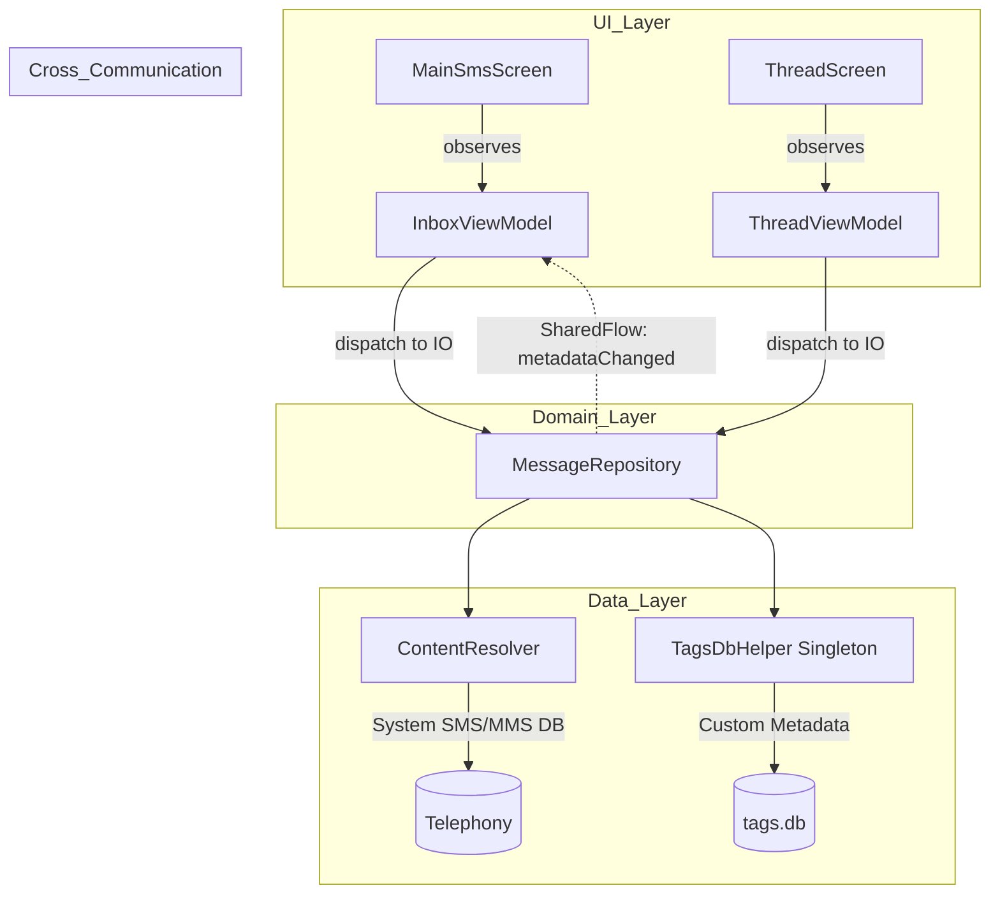

# MessageMe — Architecture Map (v2.0)

## Overview
MessageMe has evolved from a monolithic single-activity structure to a layered, reactive architecture that follows modern Android development standards.

---

## Core Components

### 1. MessageRepository (The Single Source of Truth)
- **Responsibility**: Abstracting all data sources (System SMS, Contacts, Private Tags DB).
- **Threading**: All methods are blocking I/O and must be called on `Dispatchers.IO`.
- **Reactive Signals**: Exposes `metadataChanged: SharedFlow<Unit>` to notify UI layers when metadata (tags, custom colors) changes without requiring a full system SMS refresh.

### 2. ViewModels (State Management)
- **InboxViewModel**: Manages the main message list, blocked senders, and tag/category drawer state. Survives configuration changes (rotation).
- **ThreadViewModel**: Manages specific chat history. Ensures tag, color writes, and signature checking are dispatched to background threads.

### 3. TagsDbHelper (The Metadata Engine)
- **Singleton Pattern**: Exactly one instance exists to prevent SQLite connection leaks.
- **Private Data**: Stores tags, custom bubble colors, and blocked/archived status that doesn't belong in the system telephony provider.

### 4. SettingsManager (User Preference Store)
- **Responsibility**: Manages persistent user preferences (e.g. enabling tags, showing metrics, and customizing signatures) backed by local `SharedPreferences`.

---

## Architectural Decisions (ADRs)
We maintain detailed rationale for every major shift. See:
- [ADR-001: Repository Pattern](decisions/ADR-001-repository-pattern.md)
- [ADR-002: Singleton TagsDb](decisions/ADR-002-singleton-tagsdb.md)
- [ADR-003: ViewModel State](decisions/ADR-003-viewmodel-state.md)
- [ADR-004: SharedFlow Signals](decisions/ADR-004-tagschanged-signal.md)
- [ADR-005: Identity Auth Flow](decisions/ADR-005-identity-authclient.md)

---

## Data Flow
1. **User Action**: User edits a color in `ThreadScreen`.
2. **ViewModel**: `ThreadViewModel` calls `repository.setMessageColor()`.
3. **Repository**: Updates the database and emits `Unit` on `metadataChanged` flow.
4. **Reactivity**: `InboxViewModel` collects the signal and triggers an async fetch of the updated tag/color list.
5. **UI**: The left-panel Category drawer and message list refresh automatically.

