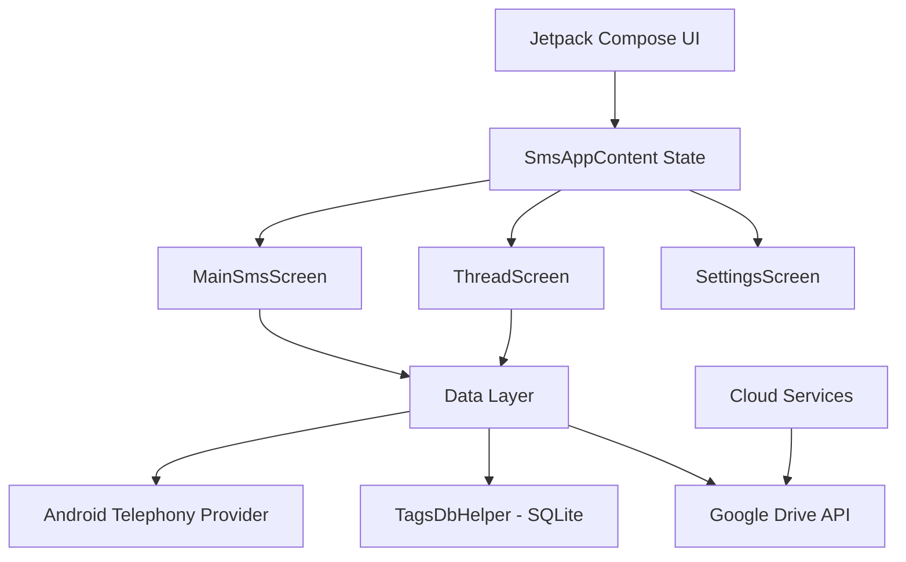

# Architecture & Technical Limitations

## System Architecture

## Data Layer Design
MessageMe uses a "Parallel Shadow Database" pattern.
- **Source of Truth for SMS:** The Android System `Telephony` provider.
- **Shadow Metadata:** A private SQLite database (`tags.db`) that maps metadata (tags, colors, flags) to the unique message IDs found in the system provider. This ensures the app is highly interoperable and doesn't corrupt system data.

## Limitations
1.  **Monolithic Structure:** Currently, most logic is in `MainActivity.kt`. This will lead to maintainability issues as the feature set grows.
2.  **MMS Support:** Basic MMS viewing is supported via URI, but advanced MMS sending/group messaging is limited compared to the SMS implementation.
3.  **Real-time Latency:** The `ContentObserver` triggers full list refreshes. For extremely large inboxes (10k+ messages), this should be replaced with `Paging 3`.
4.  **Google Drive OAuth:** Currently in "Testing" mode. Production requires official brand verification and SMS permission review by Google.

## Key Components
| Component | Responsibility |
| :--- | :--- |
| `SmsAppContent` | Top-level navigation and permission handling. |
| `TagsDbHelper` | Persistent storage for tags, blocks, and colors. |
| `backupToDrive` | XML serialization and Google Drive upload. |
| `InboxItem` | Reusable thread preview with dynamic coloring. |
